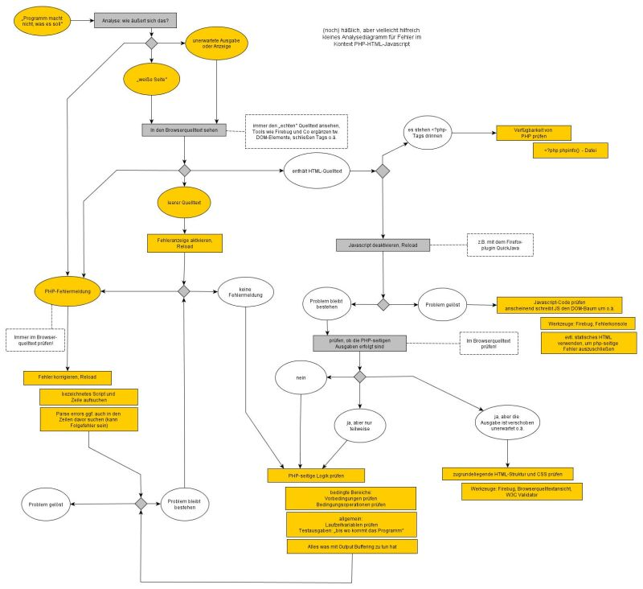

Hier findest du einen Debugging Leitfaden, der Schritt für Schritt durch Grundlagen der Fehlersuche führen soll. Die nachfolgenden Informationen beziehen sich vornehmlich auf die Analyse von Fehlern, die serverseitig in PHP auftreten. Konkrete Fehlersituationen klärt [Debugging-Standardfehler](http://php-de.github.io/debugging/standardfehler.html). 

### Hinweis

Dieser Leitfaden bezieht sich auf die Analyse von PHP Fehlern. Viele dieser Fehler können jedoch nur indirekt erkannt werden, da PHP erzeugte Fehler Teil der Browser-Ausgabe werden und somit den Anzeigegegebenenheiten des Browsers unterliegen. Es ist dringend zu empfehlen, zur Fehleranalyse immer den Browserquelltext heranzuziehen, da nur dort die Sichtbarkeit aller zur Verfügung stehenden Informationen gewährleistet ist. Nachfolgende Aussagen wie "Die Seite zeigt gar nichts an" beziehen sich immer auf den Browserquelltext. 

Ein Analysefluss lässt sich linear nur schwer darstellen, deshalb nachfolgend und einleitend ein kleines Diagramm zur Fehlereingrenzung (für volle Größe - auf das Bild klicken): 

### Ausgangssituation 1

- Die Seite zeigt gar nichts an. 
- Der Browser-Quelltext ist leer. 
 

#### Prüfe die Verfügbarkeit von PHP

Wenn das Deine ersten Schritte mit PHP sind, erstelle eine Datei test.php mit folgendem Inhalt. 

~~~ php
<?php
phpinfo();
~~~

Lade die Datei in den öffentlich erreichbaren Kontext Deines Webspace und rufe die Datei über die URL Deines Browsers auf. Wird eine Liste von PHP Settings angezeigt, hast Du sichergestellt, dass PHP generell funktioniert. 

**Hinweis:** Bei allen nachfolgenden Beispielen wird das <?php nicht mehr explizit erwähnt.

#### Erzwinge die Fehlerausgabe

Mit hoher Wahrscheinlichkeit handelt es sich um einen Fehler vor der ersten Ausgabe oder einen sogenannten Parser Fehler. Das ist ein Fehler, den PHP generiert, weil der Parser aufgrund einer Syntaxverletzung die Ausführung des Scripts nicht zu Ende führen kann. 

Platziere ganz am Anfang Deines Scripts (und natürlich hinter dem ersten öffnenden `<?php`) folgenden Code: 

~~~ php
error_reporting(-1);
ini_set('display_errors', 1);
~~~

Das weist PHP an, alle auftretenden Fehlermeldungen und -hinweise auf dem Bildschirm auszugeben. Zusätzlich sind alle @ (Fehlerkontrolloperator) vor Ausdrücken im PHP Code zu entfernen. 

Parserfehler treten auf, bevor das Skript ausgeführt wird. Daher kann das Reportverhalten im fehlerhaften Skript nicht über ini_set() beeinflusst werden. Auf dem Entwicklungsserver sollten hierfür die Parameter display_startup_errors und/oder error_log in der php.ini gesetzt werden. 

Je nachdem wie sich die Ausgabe ändert kannst Du jetzt unter 2 oder 3 fortfahren. 

### Ausgangssituation 2

- Auf dem Bildschirm werden Fehlermeldungen ausgegeben. 
 

#### Fehler verstehen

Jede Fehlermeldung, die PHP erzeugt, enthält eine kurze Beschreibung, eine Angabe zu Script und Zeilennumer, in dem der Fehler auftrat und u.U. ein sogenanntes Parser Token, das die Zeichenkette bezeichnet, die den Fehler ausgelöst hat. Alle Parser Token sind im [PHP Manual](http://php.net/manual/de/tokens.php) nachlesbar. Somit kann man ergründen, welches Element vom Parser zum Zeitpunkt des Fehlers verarbeitet wurde. 

#### Sonderfall Parser Fehler

Parser Fehler sind Fehler, die durch eine ungültige oder unvollständige Syntax ausgelöst werden. Das können bspw. fehlende Semikolons, Klammern, PHP Begrenzer (?>) oder Stringbegrenzer (Hochkommata) sein. Oftmals bemerkt der Parser diese Probleme erst Zeilen später (siehe Beispiel) und gibt dann diese Zeilennummer in der Fehlermeldung an – das kann soweit gehen, dass eine fehlende geschweifte Klammer bis zum Ende des Scripts gesucht wird. 

Beispiel 

~~~ php
echo 'Hallo';
echo 'Welt'
echo 'Hier bin ich';
~~~

Erzeugt ein 

~~~ php
Parse error: syntax error, unexpected T_ECHO, expecting ',' or ';' in Webpfad\test.php on line 4
~~~

also ein unwerwartetes T_ECHO (Parser Token für den echo() Befehl) und fordert ein Komma oder eine Semikolon an der bezeichneten Stelle.

~~~ php
echo 'Hallo
echo 'Welt';
echo 'Hier bin ich';
~~~

Erzeugt ein

~~~ php
Parse error: syntax error, unexpected T_STRING, expecting ',' or ';' in Webpfad\test.php on line 3
~~~

Diesmal stört sich der Parser an einem String (T_STRING) in Zeile 3: dem Welt. Der Grund: Das fehlende Hochkomma (') aus Zeile 2 wird solange weitergesucht, bis eines in Zeile 3 gefunden wird. Das echo aus Zeile 3 wird dabei Teil des Strings (das sieht man auch an der farbigen Markierung im obigen Quellcode). Da der String nun vollständig ist erwartet der Parser den Abschluß des Befehls mit ; oder eine Verkettung über ein Komma.

Gerade bei Parserfehlern mit oft ungenauer Angabe der Fehlerstelle ist es sehr wichtig, genau zu betrachten, welche Daten noch verarbeitet und ausgegeben werden (sozusagen bis wohin "das Script kommt") und gegebenenfalls eigene Testausgeben einzustreuen, um die genaue Fehlerstelle zu lokalisieren.

Gerade für fehlende Hochkommata ist auch ein Editor mit Syntaxhighlighting ein gutes Erkennungsmittel, da dieser über eben denselben Fehler wie der Parser stolpern wird und alle Inhalte bis zum nächsten verfügbaren Hochkomma als Stringwert markieren wird.

#### Fehler im Kontext betrachten/Folgefehler

Fehler erzeugen eine Fehlermeldung, die bei gesetztem error reporting in die Ausgabe, also ins Browserfenster (genauer in den vom Server gelieferten Browserquelltext) geschrieben werden. Einige PHP Befehle setzen aber zwingend voraus, dass bis zu ihrer Abarbeitung keinerlei Ausgabe erfolgt.

Üblicherweise sind dies Befehle zur Session- und Dokumentheader-Verarbeitung. 
Erfolgt nun eine Fehlerausgabe vor einem solchen Funktionsaufruf (und bricht dieser Fehler das Script nicht ab) ist die Folge ein weiterer Fehler, der diesen Zustand bemängelt.
Damit ist es sinnvoll, bei der Fehleranalyse immer linear vorzugehen.

### Ausgangssituation 3

- Auf dem Bildschirm werden keine Fehlermeldungen ausgegeben.
- Das Layout oder die angestrebte Funktion ist aber nicht gegeben.
 

#### Wirklich?

Gerade für Anfänger ist es wichtig, sich immer wieder die [Zusammenhänge von server- und clientseitigem Code](http://php-de.github.io/general/was-ist-php.html) klarzumachen. Da PHP vor browserseitigen Ausgaben erfolgt können Fehlermeldungen durchaus in HTML Text eingeschlossen und damit nur im Quelltext sichtbar sein. Sie können innerhalb einer Ausgabe von Javascript erzeugt worden sein und dadurch wiederum dort eine ungültige Syntax erzeugen und damit wiederum Javascript Fehlermeldungen. Schließlich haben Browser eine gewisse Fehlertoleranz auf ihr Markup, sodass irreguläre Angaben gänzlich unerkannt bleiben können.

Einfache Faustregel: PHP baut HTML und alle anderen Sprachen, die der Browser verarbeitet. Der erste Blick bei der Fehlersuche sollte also stets dem Browserquelltext dienen, die reine Bildschirmaussage sagt kaum etwas über die Probleme im Hintergrund aus. 

#### Fehler eingrenzen

Nun gilt es, den Ist- mit dem Sollzustand vergleichen. Erst wenn man genau weißt, was Du in HTML ausgeben willst/mußt, kannst Du Dich auf den PHP Quellcode stürzen. Nötigenfalls kannst Du eine statische HTML-Website erstellen, die die gewünschten Merkmale zu Funktionalität und Aussehen bietet. Dann versuchst Du, die dynamischen Teile durch PHP zu erzeugen.
Alle Fehler, die Du klar PHP zuordnen kannst, gilt es jetzt zu finden. 
Da Dein Bildschirm keine Fehlermeldungen anzeigt, handelt es sich typischerweise um eine der folgenden Situationen:

- logischer Fehler: Du hast in Deinen Überlegungen (und deren Umsetzung) einen gedanklichen Fehler
- Ressourcen Fehler: ein Textfile, Datenbankeintrag, Bild o.ä. ist nicht vorhanden oder wurde falsch abgefragt.
 

#### Zustände prüfen

Auch wenn etwas noch so logisch oder noch so unmöglich erscheint - läuft das Programm nicht heißt es: Alle Zustände prüfen. Wird ein bestimmter Programmteil nach einer Bedingung überhaupt ausgeführt? Wie oft wird eine Schleife durchlaufen? Ist die Variable gesetzt? 

#### Variablen prüfen

Eine Grundregel - lass Dir Variablen ausgeben! 

Für einfache Varibalen reicht schon ein echo Kommando. Für komplexere Typen wie Arrays und Objekte helfen print_r und var_dump. Wo print_r etwas übersichtlichere Resultate liefert ist var_dump genauer; es gibt nämlich die Typen mit an. Unschlagbar für Fälle, in denen eine Variable einen leeren String oder einen BOOL Wert enthält - hier gibt print_r schlicht gar nichts aus.
Für Ausgaben (sogenannte Dumps) von Arrays und Objekten empfielt sich weiterhin, das HTML-Script vorübergehend durch ein zu erweitern oder die Debuggingausgabe im Browserquelltext anzuschauen. Grund ist die Eigenheit von HTML-Renderings, Gruppen von Leerzeichen und Zeilenumbrüchen als ein Leerzeichen darzustellen und damit die strukturelle Darstellung von Variablendumps in einen großen Zeichenberg aufzulösen.

#### Meldungen erzeugen

Ein durchlaufener Block einer Bedingung läßt sich am einfachsten prüfen, indem man dem Code einfach eine Testausgabe wie "Bedingung erfolgreich" hinzufügt. Gleiches gilt für Schleifen. Ein ausgegebener Stern oder ein Schleifencounter ermöglicht eine einfache optische Prüfung.
Genauso einfach ist es, sich zusätzlich zur Meldung die aktuelle Zeilennumer ausgeben zu lassen:

~~~ php
... {
     echo 'Mein Debugging: Block wird durchlaufen. Zeile ' . __LINE__ . ' ';
}
~~~

Fehlermeldungen erzeugen So gut wie alle Funktionen von PHP liefern Rückgabewerte, die auch Fehlerfälle signalisieren können. Für Operationen wie Stringbearbeitung kann die beispielsweise ein boolsches FALSE sein. 

Manche Funktionen liefern auch weitreichendere Fehlermeldungen, die man explizit abfragen und ausgeben lassen kann. So z.B. Datenbankfunktionen.

#### Tipps

**var_dump()**

Solange man keine ausgefeiltere Debugging Klasse/Funktion verwendet, empfielt sich die Verwendung von var_dump für Variablenausgaben.

- Vorteil gegenüber echo: var_dump kann alle Datentypen ausgeben, während echo Objekte, Arrays oder boolsche Werte nicht aussagekräftig darstellen kann. Selbst wenn statt eines erwarteten Strings ein Objekt gesetzt wurde, erfolgt eine sinnvolle Ausgabe ohne Folgefehler.
- Gegenüber print_r werden die Werte NULL, " " (leerer String) und FALSE sowie TRUE und 1 unterschieden. Das ist sehr sinnvoll zum Debuggen von Rückgabewerten von Funktionen, die unterschiedliche Datentypen zurückgeben können (so auch viele PHP  built-in-Funktionen).
- var_dump erzeugt immer Bildschirmausgabe, weil zumindest der Typ immer mit ausgegeben wird. Gerade für Anfänger ergibt sich so nicht die zusätzliche Frage, wieso der Debuggingpunkt nicht ausgeführt wird.
 

#### Queries

Datenbankqueries, die in PHP als String angegeben werden, können besser debugged werden, wenn sie mehrzeilig notiert sind. Zum einen ist eine bessere optische Analyse möglich, zum zweiten beziehen sich Fehlermeldungen, die mysql liefert dann auf eine konkrete Zeile des Statements.

