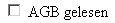
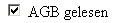
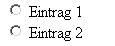

Auswahlfelder sind HTML Formularelemente, die die Auswahl einer atomaren Angabe ermöglichen. Typischerweise stellt diese Angabe eine Element einer Gruppe von Auswahloptionen dar. 

### Funktion
 
Je nach Verwendung und nach Elementtyp ergibt sich eine Funktion als  
 

| An/Aus-Auswahl (Bestätigungsfeld) |    |
|  |  |  
| Auswahl 1-aus-n (Entscheidung aus mehreren Optionsvorgaben) |    |
|  |  |  
| Auswahl n-aus-m (Multiple choice Funktionalität) |    |
  
   

Inhaltlich können die meisten diese Aufgaben auch durch [Auswahllisten](http://php-de.github.io/form/auswahllisten.html) übernommen werden. Aus Aspekten der Usability werden Auswahlfelder aber als die bessere Alternative bewertet. 

### Browserelemente
 
Aktuell stellen Browser Checkboxes und Radioboxes zur Verfügung. 

#### Checkbox-Elemente
 
- Checkboxes werden mit `<input type="checkbox">` erzeugt 
- können durch Vergabe eines identischen *name*-Attributs gruppiert werden 

#### Radiobox-Elemente
 
- Radioboxes werden mit `<input type="radio">` erzeugt 
- können durch Vergabe eines identischen *name*-Attributs gruppiert werden 

Im Gegensatz zu Checkboxes sind alleinstehende Radiobox-Elemente fürgemein nicht sinnvoll und auch nicht nutzerfreundlich, weil sie weder eine Alternativauswahl bieten, noch browserseitig wieder „abgewählt“ werden können. Im Vergleich zu Checkbox-Elementen (An/Aus-Funktion) ergibt sich hier eine Ja-oder-Ja-Funktion. 

### Auswahlfelder auswerten
 

<strong>Achtung: </strong> 
Für alle Ausgaben von Formularwerten besteht die Gefahr von Code-injection und Cross Site Scripting. Die Lehrbeispiele werden zunächst ohne entsprechende Maßnahmen reduziert dargestellt. Weitere Hinweise dazu bietet das <a href="#sicherheit">Kapitel Sicherheit</a> weiter unten.
 

#### Übertragung
 
Ein wichtiger Punkt ist die fehlende Übertragung nicht ausgewählter Elemente. Gängige Browser erzeugen keinen Parameter zu einem Auswahlelement, das nicht im Browser selektiert wurde. Dies dürfte dem Umstand geschuldet sein, dass Auswahlfelder eine freie Angabe von value-Werten (prinzipiell also auch den leeren String) ermöglichen, was zu einer Verwechselungsmöglichkeit führen würde. Zudem würde ein Form-Submit eine große Anzahl von Parametern enthalten, die nicht ausgewählten Elementen entstammen. 

Wird ein Eintrag ausgewählt wird im Request der Inhalt des *value*-Attributs des/der jeweiligen Element(e) übertragen. Wie bei allen Formularelementen kann dieser Wert PHP-seitig in den Requestarrays `$_POST` bzw. `$_GET` abgerufen werden. 

Der Schlüssel für das Array richtet sich nach der Art des *name*-Attributs, das wiederum funktionsbestimmend für gruppierte Auswahlfelder ist: 

#### Checkbox-Elemente
 
##### Übergabe als Skalarwert
 
~~~ php
<input type="checkbox" name="AGB_Best" value="Ja"> AGB gelesen
~~~

erzeugt keinen HTTP-Parameter. Wird das Element im Browser jedoch angewählt oder vorbelegt: 

~~~ php
<input type="checkbox" name="AGB_Best" value="Ja" checked="checked"> AGB gelesen
~~~

ergibt sich PHP-seitig ein Request-Parameter-Eintrag: 

~~~ php
array (
    'AGB_Best'  => 'Ja' ,
)
~~~

in `$_POST` bzw. `$_GET`. 

Für mehrere Checkboxes ist das Verhalten analog. Um eine Gruppe zu erzeugen, kann also einfach ein weiteres Element mit einem anderen Namen ergänzt werden: 

~~~ php
<input type="checkbox" name="AGB_Best" value="Ja"> AGB gelesen
<input type="checkbox" name="DSR_Best" value="Ja"> Datenschutzrichtlinien gelesen
~~~

ergibt: 

~~~ php
array (
    'AGB_Best'  => 'Ja' ,
    'DSR_Best'  => 'Ja' ,
)
~~~

wenn beide Elemente im Browser ausgewählt werden. 

Über den Namensschlüssel kann der Wert PHP-seitig ausgelesen oder geprüft werden: 

~~~ php
echo $_POST['AGB_Best']; // Ja
var_dump(isset($_POST['AGB_Best'])); // true
~~~

##### Übergabe als Wertgruppe
 
Zusammengehörige Auswahlen können auch als Array übergeben werden. Im folgenden ergibt sich so 
bspw. eine n-aus-m-Auswahl für Farben: 

~~~ php
<input type="checkbox" name="Farbe[]" value="rot"> rot
<input type="checkbox" name="Farbe[]" value="blau"> blau
<input type="checkbox" name="Farbe[]" value="gelb"> gelb
~~~

Drei Unterschiede sind hier wichtig. 

1) Alle Element benutzen ein identisches *name*-Attribut  
  
2) Das *name*-Attribut enthält abschließende eckige Klammern 
Diese beiden Faktoren erzeugen eine Array-Struktur im PHP-Kontext 

~~~ php
array (
   'Farbe'  => array (
                  0  => 'blau' ,
                  1  => 'gelb' ,
               )
)
~~~

wenn bspw. Box 2 und 3 ausgewählt wurden. Zu beachten ist die 0-basierte Numerierung der Werte - obwohl „blau“ die zweite Auswahl der Elemente im Browser ist, wird nur die Menge der übertragenen Werte betrachtet und ab 0 indexiert. 

3) Die Elemente enthalten jetzt den eigentlichen Wert im *value*-Attribut. Vorher wurde nur ein semantisch unbezogenes „Ja“ verwendet, das erst zusammen mit dem Array-Schlüssel eine Information erzeugte.  
  
  
Ein Zugriff über den Namen würde jetzt einen Array-Typ liefern. Der Eingabewert muss also mit einer Schleife verarbeitet werden oder mit einem zusätzlichen Arrayschlüssel abgefragt: 

Über den Namensschlüssel kann der Wert PHP-seitig ausgelesen oder geprüft werden: 

~~~ php
echo "Ausgabe Schleife: ";
 
foreach ($_POST['Farbe'] as $farbe) {
    echo $farbe, ' '; 
}
 
echo "\n Ausgabe Element: ";
 
echo $_POST['Farbe'][0];
~~~

~~~
Ausgabe Schleife: blau gelb 
Ausgabe Element: blau
~~~

##### Übergabe als assoziative Wertgruppe
 
Dieser dritte Punkt kann verwendet werden, um eine dritte Übergabemethode zu schaffen, sozusagen die Kombination aus den beiden genannten Varianten. Hier wird der Schlüssel wieder Bedeutungsträger, durch eine gemeinsame Namensbasis werden die Elemente trotzdem als Array gruppiert: 

~~~ php 
<input type="checkbox" name="Farbe[rot]" value="ja"> rot
<input type="checkbox" name="Farbe[blau]" value="ja"> blau
<input type="checkbox" name="Farbe[gelb]" value="ja"> gelb
~~~

Die Eingabe nach Auswahl von Box 2 und 3: 

~~~ php
array (
   'Farbe'  => array (
                  'blau'  => 'ja' ,
                  'gelb'  => 'ja' ,
               )
)
~~~

Etwas anderes als *ja* kann prinzipbedingt hier (aus dem Originalformular) gar nicht übertragen werden. 

Die gezeigten Varianten haben verschiedene Vor- und Nachteile und werden deshalb je nach Anwendungszweck benutzt. Bei Variante 2 ist bspw. der Zugriff auf die einzelnen Werte sehr einfach (über den numerischen Schlüssel), die Varianten 1 und 3 lassen sich sehr leicht auf Vorhandensein eines bestimmten Wertes prüfen (`isset()` bzw. `in_array()`). 

#### Radiobox-Elemente
 
Die Systematik entstehender Requestwerte gleicht denen der Checkbox. Namen mit [] erzeugen Array-Typen, sonst werden die Werte einzeln übertragen. Es gibt jedoch zwei Unterschiede. 

1) Assoziative Wertgruppen sind für Radiobox-Felder nicht sinnvoll, weil *name*-Attribute hier vollständig identisch sein müssen, damit das Radiofeld als Gruppe, also als 1-aus-n-Auswahl funktioniert. 

2) Auch die Übergabe als Wertgruppe ist unsinnig, weil PHP hier die Werte in einem Array strukturiert. Radio-Elemente übertragen aber prinzipbedingt immer nur einen Wert einer Gruppe, deshalb ist Variante 1 das Mittel der Wahl: 

~~~ php
<input type="radio" value="value1" name="Auswahl"> Eintrag 1
<input type="radio" value="value2" name="Auswahl"> Eintrag 2
~~~

Bei einer Auswahl des zweiten Wertes überträgt das Formular hier bei Submit also: 

~~~ php
array (
    'Auswahl'  => 'value2' ,
)
~~~

Abgefragt werden kann dieser Wert wie oben beschrieben. 

### Vorbelegen der Anzeige
 
Beide Elementtypen können durch Setzen des *checked*-Attributs vorselektiert werden. 

~~~ php
<input type="checkbox" name="Farbe[]"  value="rot" <?php echo 'checked="checked"'; ?>> rot
<input type="checkbox" name="Farbe[]"  value="blau"> blau
 
<input type="radio" name="Anrede"  value="Herr" <?php echo 'checked="checked"'; ?>> Herr
<input type="radio" name="Anrede"  value="Frau"> Frau
~~~

#### Vorbelegen mit „sich selbst“
 
Im sog. [Affenformular](http://php-de.github.io/form/affenformular.html) werden bis zur Vollständigkeit einer Formulareingabe abgesendete Werte wieder als Vorauswahl Ihrer Formularelemente verwendet. Das Prinzip ist dabei abhängig von den oben beschriebenen Übergabemethoden. 

~~~ php
<input type="checkbox" name="Farbe[]"  value="rot" 
<?php if (in_array ('rot' , $_POST['Farbe'])) { echo 'checked="checked"'; } ?>> rot
<input type="checkbox" name="Farbe[]"  value="blau" 
<?php if (in_array ('blau' , $_POST['Farbe'])) { echo 'checked="checked"'; } ?>> blau
 
<input type="radio" name="Anrede"  value="Herr" 
<?php if ('Herr' == $_POST['Anrede']) { echo 'checked="checked"'; } ?>> Herr
<input type="radio" name="Anrede"  value="Frau" 
<?php if ('Frau' == $_POST['Anrede']) { echo 'checked="checked"'; } ?>> Frau
~~~

Da dies sehr unübersichtlich ist, empfielt sich, die Formular-Elemente mit einem Array zu erzeugen: 

~~~ php
$farben = array ('rot' => 'rot' , 'blau' = > 'blau');
 
foreach ($farben as $wert => $bezeichner) {
   ?><input type="checkbox" name="Farbe[]"  value="<?php echo $wert; ?>" 
     <?php if (in_array($wert , $_POST['Farbe'])) { echo 'checked="checked"'; } ?>> <?php echo $bezeichner; 
}
 
$anreden = array ('Herr' => 'Herr' , 'Frau' => 'Frau');
 
foreach ($anreden as $wert => $bezeichner) {
   ?><input type="radio" name="Anrede"  value="<?php echo $wert; ?>" 
     <?php if ($wert == $_POST['Anrede'])) { echo 'checked="checked"'; } ?>> <?php echo $bezeichner; 
}
~~~

Die bisherigen Beispiele gehen davon aus, dass `$_POST['Anrede']` bzw. `$_POST['Farbe']` existieren. Da dies nicht garantiert ist, muss dieser Fall zusätzlich abgefangen werden. Wir wollen gleichzeitig eine lesbare Variante anbieten: 

~~~ php
$farben = array ('rot' => 'rot' , 'blau' = > 'blau');
 
foreach ($farben as $wert => $bezeichner) {
    if (isset($_POST['Farbe']) && in_array ($wert , (array) $_POST['Farbe'])) {
        $checked = 'checked="checked"';
    } else {
        $checked = '';
    }
 
    printf (
           '<input type="checkbox" name="Farbe[]"  value="%s" %s>%s'
           $wert ,
           $checked ,
           $bezeichner
           );
}
 
$anreden = array ('Herr' => 'Herr' , 'Frau' => 'Frau');
 
foreach ($anreden as $wert => $bezeichner) {
    if (isset ($_POST['Anrede']) && $wert == $_POST['Anrede']) {
        $checked = 'checked="checked"';
    } else {
        $checked = '';
    }
 
    printf (
            '<input type="radio" name="Anrede" value="%s" %s>%s'
            $wert ,
            $checked ,
            $bezeichner
           );
}
~~~

### Verwandtschaft mit Auswahllisten
 
Wie bereits angedeutet sind Auswahllisten und gruppierte Auswahlfelder größtenteils austauschbar. Sowohl inhaltliche Funktion als auch PHP-seitige Verarbeitung (natürlich abgesehen vom HTML-Code des jeweiligen Elements) können 

- gruppierte Radioboxes gegen ein Single-Select
- nach der Variante „Übergabe als Wertgruppe“ gruppierte Checkbox-Felder gegen eine Multi-Select-Liste ausgetauscht werden.

Gruppen aus Auswahlfeldern werden allerdings als benutzerfreundlicher angesehen. Besonders Multi-Select-Listen sind wesentlich schlechter bedienbar. 

### Sicherheit
 
Für die Eingaben von Werten aus Auswahlfeldern gilt das übliche Gefahrenpotential von HTML-seitigen Ausgaben oder Verarbeitungen in Kontexten wie Datenbankqueries. Einen Überblick bieten die Artikel [Formularverarbeitung, Sicherheit](http://php-de.github.io/form/sicherheit.html) und die [Ausführungen zum verwandten Selection-Element](http://php-de.github.io/form/auswahllisten.html#sicherheit). 

<strong>Achtung!</strong> Häufig gemachter Fehler:  
Für Auswahlfelder und -listen werden die Gefahren von XSS oftmals unterschätzt, weil sie im Gegensatz zu Textfeldern keine direkte Eingabe von Schadcode ermöglichen. In Anbetracht der Tatsache, dass in einem gefälschten Formular allein die richtige Angabe des <em>name</em>-Attributs ausreicht, um beliebige Werte und Werttypen für beliebige Elemente übermitteln zu können, ist die Annahme jedoch haltlos und damit besonders gefährlich.
 

