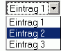
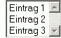

| **Selections** oder **Auswahllisten** sind HTML Formularelemente, die eine Liste von Werten einer fest definierten Menge zur Auswahl bereitstellen. Selections können als Einfach- oder Mehrfachauswahl notiert werden. Dabei wird in Einfachlisten üblicherweise immer ein Wert übertragen, in Mehrfachlisten kann kein, ein oder mehrere Werte ausgewählt und übertragen werden. |  |  |

| Je nach Selectiontyp unterscheiden sich die Verfahren zur Verarbeitung und Darstellung. Die jeweiligen Verfahren sind dabei mit denen für Optionsfelder (Radiogroups bzw. Checkboxes) verwandt/identisch. |  |  |

### Selections auswerten

Wie bei allen Formularelementen können die Werte eines innnerhalb eines `<form>`-Tags notierten `<select>`-Elements durch Auslesen eines Parameterarrays im Folgescript verarbeitet werden. Näheres dazu siehe unter [Formularverarbeitung Überblick](http://php-de.github.io/form/form.html). 

#### Einfachauswahlen

Für einfache Selections wird im HTML-Teil eine skalare Variable als *name*-Attribut des Formelements notiert: 

~~~ php
<select name="Auswahl">
    <option value="value1">Eintrag 1</option>
    <option value="value2">Eintrag 2</option>
</select>
~~~

Folglich steht der Wert auch dementsprechend im Eingabeparameter des Folgescripts (hier nach Absenden bei Auswahl der ersten Option):

~~~ php
array (
 'Auswahl' => 'value1'
)
~~~

Auf diesen Wert kann nun einfach über den *name*-Attribut gleichen Schlüssel zugegriffen werden, bspw.

~~~ php
echo $_POST['Auswahl'];
~~~

#### Mehrfachauswahlen

Ein HTTP Request überträgt zwar alle ausgewählten Werte eines entsprechenden Mehrfachauswahlfeldes, nur werden diese anschließend in die superglobalen Parameterarrays unter ihrem Variablennamen als Schlüssel hinterlegt und damit folglich alle Werte bis auf den letzten von den folgenden überschrieben.
Die Lösung ist, im name-Attribut von vornherein eine Arrayvariable anzugeben:

~~~ php
<select name="Auswahl[]" multiple="multiple">
    <option value="value1">Eintrag 1</option>
    <option value="value2">Eintrag 2</option>
</select>
~~~

Damit ergibt sich auch im Parameterarray eine Arraystruktur:

~~~ php
array (
  'Auswahl' => array ( 
     0 => 'value1' ,
     1 => 'value2' ,
  )
)
~~~

hier für den Fall, dass beide Werte vor dem Absenden ausgewählt wurden. Der Zugriff kann nun natürlich nur wie für ein Array üblich, über einen Sub-Index oder eine Arrayfunktion erfolgen:
 
~~~ php
// gibt das erste Element aus,  
// Achtung! Erzeugt einen Fehler, wenn kein Eintrag ausgewählt war
echo $_POST['Auswahl'][0]; 
 
// gibt alle Elemente aus
foreach ($_POST['Auswahl'] as $value) {
    echo $value; 
}
?>
~~~~

<strong>Achtung: </strong>Für alle Ausgaben von Formularwerten besteht die Gefahr von Code-injection und Cross Site Scripting. Die Lehrbeispiele werden zunächst ohne entsprechende Maßnahmen reduziert dargestellt. Weitere Hinweise dazu bietet das Kapitel <a href="#sicherheit">Sicherheit</a> weiter unten.

### Selection mit Vorauswahl dynamisch erzeugen

In verschiedenen Fällen kann es nötig sein, dass Selections bei der Ausgabe dynamisch mit einem oder mehreren gegebenen Auswahlwerten vorselektiert werden. Nachfolgend wird zunächst das Prinzip erklärt und dann eine optimierte Variante gezeigt. In allen Beispielen werden als gegebene Auswahlwerte die Eingabeparameter aus einem [POST-Submit](http://php-de.github.io/request-handling/request.html#post) angenommen, wie es bspw. beim [Affenformular](http://www.php.de/wiki-php/index.php/Affenformular_%28Standardverfahren%29) üblich ist. Natürlich kann statt der `$_POST`-Angabe auch jede andere Variable gleichen Typs genutzt werden.

#### Funktionsprinzip

Der oder die selektierten Auswahlwert einer Auswahlliste wird HTML-seitig über das Attribut `selected="selected"` im zugehörigen `<option>` Element notiert. Damit ergibt sich folgendes Prinzip, das anhand einer Wertvergleichsoperation die jeweilige Ausgabe des Attributwertes erzeugt:

*Bsp. 1, Wiederauswahl für Einfachauswahlen*

Einfache PHP Umsetzung des Funktionsprinzips. Es wird von einer POST-Übermittlungsmethode des zugrundeliegenden Formulars ausgegangen.

~~~ php 
<?php
// selektierter Eintrag, hier aus einem Submit
$selectedValue = $_POST['Auswahl'];
 
?>
<select name="Auswahl">
 
  <option value="value1" 
          <?php 
 
          if ('value1' == $selectedValue) { 
              echo 'selected="selected"';
          }   
          ?>>Eintrag 1</option>
 
  <option value="value2" 
          <?php 
 
          if ('value2' == $selectedValue) { 
              echo 'selected="selected"';
          }   
          ?>>Eintrag 2</option>
 
</select>
~~~

#### Einfachauswahlen

Einen ersten Ansatz für Einfachauswahlen haben wir gerade kennengelernt. Wie deutlich zu erkennen, ist dabei der Overhead, den die Funktion zum Wiederbefüllen erzeugt, relativ hoch. Optimiert werden kann der Code, wenn die Optionsbezeichner und -werte als Array vorliegen und sowohl die eben gezeigte Prüfung, als auch die gesamte Ausgabe des `<option>`-Elements in einer Schleife erfolgt. Gerade bei erhöhter Wertanzahl ergibt sich hier ein schlanker und übersichtlicher Code. Zudem ergibt sich eine leichte Möglichkeit zum Abändern der Einträge.

*Bsp. 2, Wiederauswahl für Einfachauswahlen*

Optimierte PHP Umsetzung mir Wertarray für die Lösung aus 1. Es wird von einer POST-Übermittlungsmethode des zugrundeliegenden Formulars ausgegangen.

~~~ php
<?php
// selektierter Eintrag, hier aus einem Submit
$selectedValue = $_POST['Auswahl'];
 
?>
<select name="Auswahl">
  <?php
 
  // gegebene Selectionwerte als Array  value => Beschreibung
  $options = array (
                   'value1' => 'Eintrag 1' ,
                   'value2' => 'Eintrag 2' ,
                   );
 
  foreach ($options as $value => $description) {
 
     // Prüfung, ob selektierter Wert, man beachte das Leerzeichen
     $attribute = ($value == $selectedValue) ? ' selected="selected"' : '';
 
     // Ausgabe des <option> Elements
     sprintf (
             '<option value="%s"%s>%s</option>' ,
             $value ,
             $attribute ,
             $description
             );
  }
  ?>
</select>
~~~

Der Code ist deutlich übersichtlicher als das erste Beispiel (bei mehr Elementen steigert sich dieser Effekt), vermindert das Fehlerrisiko und hilft, Code einzusparen.
Der Auswahlstatus wird in jedem Schleifendurchlauf mit einer Prüfung wie oben bestimmt; zum Einsatz kommt hier der sog. Trinäroperator.
 
Für die Ausgabe wird hier beispielhaft das `sprintf`-Statement verwendet, um das `<option>`-Element deutlicher abzusetzen, eine Lösung mit Stringkonkatenation ist aber ebenso möglich.

<strong>Information: </strong>Die Arraylösung ist nicht für alle Zwecke geeignet. Da Arrays eindeutige Schlüssel besitzen, erlaubt sie bspw. keine Selections mit mehrfacher Angabe eines identischen Optionswertes. Zu diesem Zweck muß der obige Code geringfügig abgewandelt werden.

#### Mehrfachauswahlen

Wie oben beschrieben, liegen die Werte übertragener Multiselects immer als Array vor (jedenfalls wenn mans richtig macht). Ein direkter Stringvergleich bringt uns hier also nicht weiter, weil zwei Wertmengen (die aller möglichen Werte und die aller übertragenen Werte) gegeneinander verglichen werden müssen.

Für die obige Schleifenlösung bietet sich `in_array()` an:
  
*Bsp. 3, Wiederauswahl für Mehrfachauswahlen*

PHP Umsetzung mit Wertarray,Es wird von einer POST-Übermittlungsmethode des zugrundeliegenden Formulars ausgegangen.

~~~ php
<?php 
 
// selektierte Einträge, hier aus einem Submit
$selectedValues = (array) $_POST['Auswahl'];
 
?>
<select name="Auswahl[]" multiple="multiple">
  <?php
 
  // gegebene Selectionwerte als Array  value => Beschreibung
  $options = array (
                   'value1' => 'Eintrag 1' ,
                   'value2' => 'Eintrag 2' ,
                   );
 
  // man beachte wiederum das Leerzeichen
  $selectAttr = array();
  $selectAttr[true] = ' selected="selected"';
  $selectAttr[false] = '';
 
  foreach ($options as $value => $description) {
 
     // Prüfung, ob selektierter Wert, speichert einen bool Typ
     $isSelected = in_array ($value , $selectedValues);
 
     // Ausgabe des <option> Elements
     sprintf (
             '<option value="%s"%s>%s</option>' ,
             $value ,
             $selectAttr[$isSelected] ,
             $description
             );
  }
  ?>
</select>
~~~

Die Funktion `in_array()` untersucht hier den aktuell durchlaufenen Optionwert auf Vorhandensein im Parameterarray. Für die Zuordnung des *selected*-Attributs wurde hier eine Alternativmöglichkeit aufgezeigt.

<strong>Achtung: </strong>Da Mehrfachauswahlen auch den Zustand "keine Auswahl" zulassen, sollte der entsprechende Eintrag im Parameterarray stets explizit nach Array gecastet werden, im Bsp. hiermit: `(array) $_POST['Auswahl']`. Ansonsten kann die Verarbeitung des Elements einen Fehler erzeugen.

### Sicherheit

Für alle Ausgaben auf Formularübermittlung ergibt sich die Gefahr von Code-Injection und Cross Site Scripting. Zudem unterliegen Selections noch der Gefahr von Typverletzungen.

Direkte Ausgaben wie diejenigen mit `echo` in [Selections auswerten](#selections-auswerten), sind genauso anfällig, wie Eingaben aus einem Textfeld. Letzten Endes hat der Programmierer keinen Einfluß darüber, ob die Eingaben tatsächlich aus einem Select erfolgen. Daraus resultieren auch weitere wichtige Punkte:
Obwohl die oben gezeigte Wiederauswahl dynamischer Auswahlliste augenscheinlich ohne Ausgabe des Wertes auskommt, ergibt sich hier eine andere Gefahr. So werden bspw. übermittelte Auswahlen aus Multiselections als Arraytyp erwartet. Ist die Eingabe dagegen leer oder ein String, wird das Script ohne Maßnahmen wie das oben verwendete Typcasting über `(array)` einen Fehler erzeugen. Übrigens ist auch die Umkehrung gültig: Wird an eine Einfachauswahl ein Werte*array* übermittelt (bspw. über ein Multiselect eines gefälschten Formulars) wird jeder Wertvergleicht, wie `($value == $selectedValue)` in Code-Bsp. 2, mit einem Fehler quittiert.
Übrigens unterliegen auch ungefälschte Multiselect dem Typproblem. Genau wie Checkboxfelder werden in Formularen hier nur Elemente mit mindestens einer Auswahl übermittelt. Ein Lösungsansatz kann hier eine vorhergehende Prüfung des übermittelten Wertes sein:

*Bsp. 4, Wiederauswahl für Einfachauswahlen*

Erweiterung von Bsp. 2 um eine Typ/Wertprüfung

~~~ php
<?php 
 
// Vorabprüfung von Typ und Wert
if (false === isset($_POST['Auswahl']) || false === is_string($_POST['Auswahl'])) {
    $selectedValue = '';
} else {
    $selectedValue = $_POST['Auswahl'];
}
 
?>
<select name="Auswahl">
  <?php
  $options = array (
                   'value1' => 'Eintrag 1' ,
                   'value2' => 'Eintrag 2' ,
                   );
 
  foreach ($options as $value => $description) {
     // ...
  }
  ?>
</select>
~~~

Im Zuge einer Validierung zur Erkennung von Angriffen kann auch das vordefinierte Wertearray benutzt werden. Dazu ziehen wir die Wertedefinition etwas vor:

*Bsp. 5, Wiederauswahl für Einfachauswahlen*

Erweiterung von Bsp. 4 um eine Prüfung auf konkrete Wertmenge

~~~ php
<?php 
 
$options = array (
                 'value1' => 'Eintrag 1' ,
                 'value2' => 'Eintrag 2' ,
                 );
 
// Vorabprüfung von Typ und Wert
if (isset($_POST['Auswahl']) {
    $selectedValue = $_POST['Auswahl'];
 
    // Prüfung auf gefälschte Übergabe
    if (false === is_string($selectedValue) || false === in_array($selectedValue , $options)) {
 
        // Angabe kann nicht aus dem Select stammen
        // ... geeignete Maßnahmen, Abbruch oder:
 
        $selectedValue = '';
    }
}
else {
    $selectedValue = '';
}
 
 
?>
<select name="Auswahl">
  <?php
  foreach ($options as $value => $description) {
     // ...
  }
  ?>
</select>
~~~

Für Mehrfachauswahlen kann analog eine Prüfung über `array_diff()` vorgenommen werden.

*Bsp. 6, Wiederauswahl für Mehrfachauswahlen*

Erweiterung von Bsp. 3 um eine Prüfung auf konkrete Wertmenge

~~~ php
<?php 
 
$options = array (
                 'value1' => 'Eintrag 1' ,
                 'value2' => 'Eintrag 2' ,
                 );
 
// Vorabprüfung von Typ und Wert
if (isset($_POST['Auswahl']) {
    $selectedValue = $_POST['Auswahl'];
 
    // Prüfung auf gefälschte Übergabe
    if (false === is_array($selectedValue) || 
        array() !== array_diff($selectedValue, $options)) {
 
        // Angabe kann nicht aus dem Select stammen
        // ... geeignete Maßnahmen, Abbruch oder:
 
        $selectedValue = array();
    }
} else {
    $selectedValue = array();
}
 
?>
<select name="Auswahl[]" multiple="multiple">
  <?php
  foreach ($options as $value => $description) {
     // ...
  }
  ?>
</select>
~~~

<strong>Achtung! </strong>Häufig gemachter Fehler: 
Für Auswahlfelder und -listen werden die Gefahren von XSS oftmals unterschätzt, weil sie im Gegensatz zu Textfeldern keine direkte Eingabe von Schadcode ermöglichen. In Anbetracht der Tatsache, dass in einem gefälschten Formular allein die richtige Angabe des name-Attributs ausreicht, um beliebige Werte und Werttypen für beliebige Elemente übermitteln zu können, ist die Annahme jedoch haltlos und damit besonders gefährlich.

