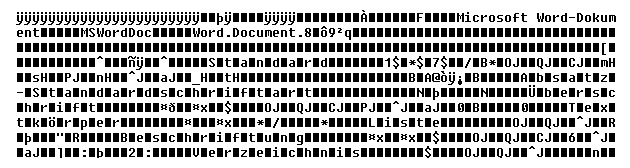

Sogenannte **Textauszeichnungen** oder neudeutsch *Markup* bezeichnen allgemein
das Versehen eines Text- oder Codebereiches mit einer semantischen oder
anderweitig gearteten Formatieranweisung. Viele Textauszeichnungen sind dabei
als einfacher (*plain*) Text ausgeführt und benutzen lediglich einige
Sonderzeichen wie bestimmte Klammern, um die Formatierung vom Fließtext
abzugrenzen.

Durch das World wide web bekannt geworden sind vor allem das HTML-Format, sowie
das damit verwandte XML und andere SGML-Dialekte. Aber auch Formate wie Rich
Text Format (RTF) oder verschiedene Editorformate von Internetforen haben sich
als Markupstandards etabliert.

Klartext-Auszeichnungsformate bieten echte Vorteile gegenüber üblichen
Binärformaten: Sie können mit einfachen Mitteln, bspw. einem simplen
Texteditor, geöffnet und bearbeitet werden, sie sind oft für Menschen
verständlich, weil sie eine Syntax benutzen, die an menschliche Sprache
angelehnt ist. Schließlich können sie maschinell einfach interpretiert werden –
insofern die Spezifikation des Formates hinreichend genau ist –, sind dabei
weitgehend systemunabhängig usw. Das Beispiel am Ende des Artikels verdeutlicht
den Unterschied von Klartextformaten gegenüber einem binären Typ.

### Abgrenzung

Auch wenn eine Abgrenzung zu modernen Scripts und Hochsprachen oft schwierig
ist, gelten Markup-Sprachen genau genommen nicht als Programmiersprachen, weil
ihnen grundlegende Kontrollstrukturen fehlen. HTML wird also nicht
*programmiert*, trotzdem kann man wohl gemeinhin von einem Quellcode sprechen.

### HTML und XML

HTML bildet eine Untermenge (bzw. definierte Ableitung) des allgemeineren XML
Formates aus, in der die Menge aller zum Sprachraum gehörigen Markup-Elemente
festgelegt ist. Als Vorteil ergibt sich daraus eine Art Bildungsvorschrift, die
Dokumenttypdefinition (DTD), anhand derer die sprachliche Korrektheit
(Validität) eines Dokumentes verifiziert werden kann. Neben der Definition von
zum Sprachraum gehörigen Syntaxbestandteilen beschreibt die DTD auch gültige
Verschachtelungsarten der einzelnen Elemente und die gültigen Parameterangaben.

Der Sprachraum von HTML ermöglicht eine semantische Auszeichnung von Text- und
Layoutelementen, die ein formatiertes Webdokument beschreiben. Im Laufe der
Zeit wurde der Elementumfang auch um einige spezielle Nicht-Inhaltselemente
(wie Formularelemente) und leider auch um den Wildwuchs einiger Elemente zur
direkten Textformatierung bereichert.

#### Syntax Überblick

HTML und XML beschränken sich auf Elemente, die durch ein Schlüsselwort erzeugt
werden, das in spitzen Klammern (`<`, `>`) eingeschlossen ist. Diesen Elementen
können desweiteren bestimmte Attribute zugeordnet sein, die eine bestimmte
Ausformung oder ein Verhalten des Strukturelementes spezifizieren.

Da XML keine bestimmte Elementmenge definiert, beziehen sich die nachfolgenden
Ausführungen auf HTML.

Alle Auszeichnungen – sogenannte *tags* – sind an den englischen Sprachschatz
angelehnt und damit funktionsbeschreibend.

* `<strong>` bezeichnet einen betonten Textabschnitt
* `
` bezeichnet die Einleitung eines Textkapitels (paragraph)
* `<table>` bezeichnet die Einleitung einer Tabelle

Im strikten Sprachstandard sind alle ausgezeichneten Elemente von öffnenden und
schließenden Tags eingeschlossen. Weiterhin sind Standalone Tags definiert, die
inhaltsleer gekennzeichnet ein eigenständiges (meist Nicht-Text-) Element
bilden:

* ` ` bildet einen Zeilenumbruch im aktuellen Fließtext
* `<input type="checkbox" />` fügt ein Eingabefeld (hier eine sogenannte *Checkbox*)
  an der aktuellen Position ein

HTML und XML beschreiben vollständige Dokumente, weshalb die Syntax Elemente
für Metadaten und rein relationale Daten umfasst. So kann das Dokument
unabhängig von seiner physischen Anmutung im Kontext seiner Umgebung (Herkunft,
Relation zu anderen Dokumenten) dargestellt, als auch mit anderen Dokumenten
(bspw. Angaben zur optischen Formatierung für verschiedene Medien)
ausgezeichnet werden.

#### Exkurs Semantik

Während das XML Format genau genommen eine freie Definition verwendeter
Auszeichnungen erlaubt, unterliegt HTML einer fest definierten
„Befehls“-Struktur, erhebt aber trotzdem weitgehend den Anspruch, Text- und
Layoutelemente *semantisch* auszuzeichnen. Ein Element wird dabei *als etwas*
(bspw. als Textüberschrift) beschrieben, nicht jedoch *wie etwas* formatiert.

Dieser Fakt ist der Schlüssel zu modernem Webdesign, das neben rein
gestalterischen Kriterien auch Elemente wie Barrierefreiheit, Usability und
Individualität berücksichtigt. Während ein in 20pt bold formatierter
Textabschnitt allenfalls optisch aus Erfahrungen mit Printmedien als
Überschrift wahrgenommen wird, ermöglicht eine explizite Auszeichnungs als
„Headline“ weit mehr:

* Benutzbarkeit für körperlich eingeschränkte User. So kann bspw. ein sogenannter
  Screenreader Überschriften erkennen und danach eine Dokumentstruktur
  aufbereiten
* Individualisierbarkeit: Ein Nutzer kann Überschriften anhand seines
  Browser-Stylesheets nach persönlichem Geschmack anzeigen lassen
* Wiederverwendbarkeit: Ein semantisch augezeichneter Text kann ohne Änderungen
  in verschiedenen Layouts dargestellt werden
* Maschinenlesbarkeit und systemübergreifendes Verarbeiten: Ein explizit
  ausgezeichnetes Textelement kann in einem komplett anderen Bereich als der
  visuellen Darstellung verarbeitet werden.

#### HTML als semantisches Dokument

Das zunehmende Bedürfnis nach einer semantischen Begrifflichkeit
HTML-formatierter Dokumente, hat bereits zu erster Kritik am Dokumentformat
geführt. So fehlen grundlegende semantische Auszeichnungen für oft genutzte
Seitenstrukturelemente (bspw. Menüs oder Adressfelder). Die erzielte Semantik
bezieht sich desweiteren weitgehend auf die Darstellung als Textdokument
(*Hypertext* Markup) und läßt andere Medienelemente weitgehend unberührt. Das
Beispiel am Ende des Beitrags zeigt, wie XML, losgelöst vom Kontext des
Textdokumentes, eine zweckgebundene Semantik abbilden kann.

#### Die HTML Erweiterung Mikroformate

Einen Lösungsansatz versucht das Konzept der Mikroformate zu bieten. Dabei wird
versucht, HTML Tags über ihre allgemeingültigen Attribute als semantisches
Element zu vereinheitlichen. So ist bspw. das `class`-Attribut für jedes Tag
verfügbar und mit fast beliebigen Informationen belegbar, ohne die Validität
des HTML-Dokuments zu beeinträchtigen.

Mikroformate werden themenorientiert entwickelt und sind deswegen konkreter als
native HTML-Auszeichnungen.

### HTML-Derivate

Aus verschiedenen Anforderungen – meist aber aus der Suche nach in HTML
editierbaren Auszeichnungsformen – haben sich verschiedene an HTML angelehnte
Formate entwickelt. Die Hauptanwendung besteht darin, einen dermaßen
ausgezeichneten Text als Inhalt in HTML-Syntax zu überführen.

#### BB-Code

Die Einführung von BB-Code entspringt der Problematik, dass innerhalb von
Webdokumenten eine Beschreibung eines Formatierungsstandards nicht möglich ist,
ohne das Dokument selbst zu verändern. Aus diesem Problem heraus wurde BB-Code
geboren, der weitgehend HTML-Code-Auszeichnung mit einer alternativen Syntax
adaptiert.

BB-Code hat sich als einfache Syntaxvariante zu in HTML-Formularen editierbarer
Textauszeichnung entwickelt und ist in verschiedenen Abwandungen in Wikis,
Foren und Content Management System weltweit verbreitet im Einsatz.

##### Syntax Überblick

Viele HTML-Formatierungen sind in BB-Code wiederzufinden, wobei hier eckige
Klammern verwendet werden. BB-Code kann auch Parameter oder vereinfachte Tags
enthalten, die Syntax ist allerdings nicht hinreichend standardisiert.

* `[strong]` bezeichnet einen betonten Textabschnitt
* `[*]` bezeichnet die Einleitung eines Listenelementes (paragraph)
* `[url]` beschreibt eine Zeichenkette als Weblink

BB-Code versteht sich als inline Formatierung, bildet also keine vollständigen
Dokumentstrukturen ab. Darum verfügt BB-Code-Syntax über keine Elemente, die
Dokumentstrukturen oder Metadaten kennzeichnen.

#### Wikisyntax

Sowohl Wikisyntax als auch Textile beschreiten ein interessanten Weg: Sie lösen
sich von der reinen HTML-Syntax und suchen nach neuen, intuitiveren
Auszeichnungsformen. Dabei wird bspw. auf optisch ähnliche Syntax
zurückgegriffen (`_Wort_` für unterstrichene Begriffe) oder der Zeilenumbruch
für blockbildende Elemente genutzt.

Beide Formate kommen damit Autoren längerer Fließtexte entgegen, indem sie
Editierbarkeit vor Parsing-Aufwand stellen.

#### Textile

Textile ist eine Formatsprache des Textpattern CMS und benutzt eine reduzierte,
aber für durchschnittliche Textdokumente weitgehend ausreichende Syntax.

### Rich Text

Im Gegensatz zu HTML versteht sich Rich Text Format als
Textformatierungssprache. Obgleich es auch semantische Auszeichnungen erlaubt,
kann man es wohl als Klartextalternative zu binären Formaten von
Textverarbeitungsprogrammen verstehen.

#### Syntax Überblick

Syntaxbestandteile werden hier durch `\` eingeleitet und sind zumeist Abkürzungen
englischer Bezeichner. Auch Rich Text macht Gebrauch von schließenden
Auszeichnungselementen, gekennzeichnet durch eine abschließende Null. RTF wirkt
weit kryptischer, zumal Zeilenumbrüche und Leerzeichen vom Parser
berücksichtigt werden.

RTF-Dokumente werden durch einen typischen Dokumentheader eingeleitet, der
Neben Dokumenttyp-Angaben zu Zeichensatz und Basis-Schriftart Farbtabellen und
ähnliches enthält.

* `\par` bezeichnet die Einleitung eines Textkapitels (paragraph)
* `\b` bezeichnet die Einleitung eines fettgedruckten (bold) Textbereichs

### Vergleichende Beispiele

Lediglich XML schafft es von den hier vorgestellten Formaten, einen Inhalt
sachgebunden auszuzeichnen. Alle anderen Formate beschreiben den Inhalt in
einer Art, die sich an der Ausgabe auf einem optisch wahrnehmbaren Medium
orientiert. Eine typische Ausgabe könnte dabei bspw. so aussehen:

Erzielte Formatierung:

* This is only a test of the **emergency** broadcast system.
* This is only a test of the *emergency* broadcast system.

XML kann diesen Sachverhalt medienunabhängig abbilden und überläßt es dabei
einer anderen Instanz, die enthaltenen Informationen bildschirmgerecht
aufzubereiten.

Semantische XML Auszeichnung, einfache Dokumentsyntax:

~~~
<?xml version="1.0"?>
<transmission>
    <phrase>This is only a test of the <significant>emergency broadcast system</significant>.</phrase>
    <phrase>This is only a test of the <emphatic>emergency broadcast system</emphatic>.</phrase>
</transmission>
~~~

HTML und erst recht Textverarbeitungs-orientierte Dokumentformate beschreiben
den Inhalt bereits hinsichtlich seiner Ausprägung in einer Textstruktur: So
werden bspw. Absätze berücksichtigt.

Pseudo-semantische HTML Auszeichnung, reduzierte Dokumentsyntax:

~~~ html
<html>
    <head />
    <body>
        
This is only a test of the <strong>emergency broadcast system</strong>.

        
This is only a test of the <em>emergency broadcast system</em>.

    </body>
</html>
~~~

Rich Text Format, Dokumentsyntax:

~~~
{\rtf1\ansi\ansicpg1252\deff0\deflang1031{\fonttbl{\f0\froman\fprq2\fcharset0 Times
New Roman;}{\f1\fswiss\fcharset0 Arial;}}
{\*\generator Msftedit 5.41.15.1507;}\viewkind4\uc1\pard\lang1023\f0\fs24 This is
only a test of the \i emergency broadcast system\i0 .\par
This is only a test of the \b emergency broadcast system\b0 .\lang1031\f1\fs20\par
}
~~~

Word-Formatierung, Binärcode mit nicht druckbaren Zeichen (Auszug):

