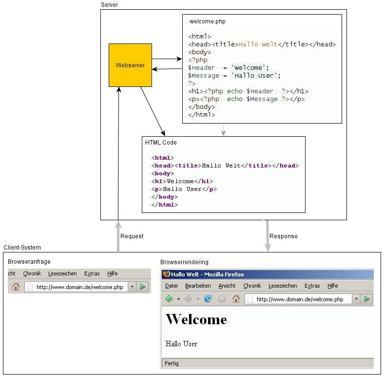

**... und was ist es nicht?** 

Oft zeigt sich bei PHP-Einsteigern, dass ein grundlegendes Verständnis dafür fehlt, was PHP eigentlich genau ist, wofür es zu gebrauchen ist und eben auch, wofür es nicht zu gebrauchen ist. 

### Was PHP ist 
PHP ist eine Skript-Sprache, die komplett auf dem Server verarbeitet wird. Das heißt, der Benutzer kommt mit dem Quelltext des Skripts gar nicht erst in Berührung.
PHP ist darauf ausgelegt, durch Programmoperationen eine andere Sprache, zumeist Hypertext-Markup (also HTML), zu erzeugen, die auf anderen Geräten weiterverarbeitet werden kann. Hieraus ergibt sich auch die Bedeutung des Backronyms PHP, welche PHP: Hypertext Preprocessor lautet.  

Um ein PHP-Skript aufzurufen, wird ein [Request](http://php-de.github.io/request-handling/request.html) an den Server abgesetzt, welcher dann den PHP-Parser anweist, das entsprechende Skript zu parsen. Anschließend wird die erzeugte Ausgabe wieder zurück an den Benutzer gesendet. Lediglich diese Ausgabe des Skripts ist es dann, welche der Benutzer zu Gesicht bekommt. 

#### Somit ist mit PHP folgendes möglich: 
- Verarbeiten der über einen Request gesendeten Daten 
- Verbindungen zu anderen Servern, Diensten etc. 
- Datei- und Datenbankoperationen auf dem Server 
- Aufruf oder Einbindung anderer Skripte auf dem Server 
 

### Was PHP nicht ist 
PHP ist hingegen nicht dazu gedacht, direkt mit dem Benutzer zu interagieren, sprich: es ist nicht möglich, direkt auf Eingaben vom Benutzer zu reagieren, sofern diese nicht durch einen erneuten Request an den Server gesendet wurden.
Für direkte Interaktion mit dem Benutzer ist [JavaScript](http://www.php.de/wiki-php/index.php/JavaScript) gedacht, welches (genau entgegengesetzt zu PHP) im Browser des Benutzers läuft, hingegen nicht auf dem Server ausgeführt wird. 

#### Somit ist mit PHP folgendes nicht möglich: 
- Direkte Verarbeitung von Benutzereingaben bzw. aktive Interaktion mit dem Anwender 
- Operationen im Browser des Anwenders 
- Kontrolle des Browsers, Auslesen von Browser- oder Clientsystemzuständen 
- Eindeutige und unfehlbare Benutzeridentifikation 
 

### Merkhilfe 
Im normalen Kontext - Browser ruft Website auf - stellen sich die Rollen von HTML und PHP so dar: 
  
Der Aufruf einer HTML Seite liefert ein Hypertextdokument, das durch den Browser gerendert, d. h. angezeigt wird. 
Der Aufruf einer PHP Seite startet ein Programm, das ein Hypertextdokument erzeugt. Das Hypertextdokument wird wiederum durch den Server ausgeliefert und im Browser gerendert. 

PHP geschieht also vor allen Sprachen und Formatierungen, die im Browser zum Einsatz kommen (HTML, Javascript, CSS). PHP ist von einem Server (also so gesehen von einer bestehenden Internetverbindung) abhängig, clientseitige Sprachen sind es nicht (insofern der Quelltext lokal auf dem Client PC existiert). Ein HTML Code mit Stylesheets und Javascript Funktionalität kann also auf einen Client PC heruntergeladen lokal vom Browser verarbeitet werden. PHP Code dagegen nicht.

