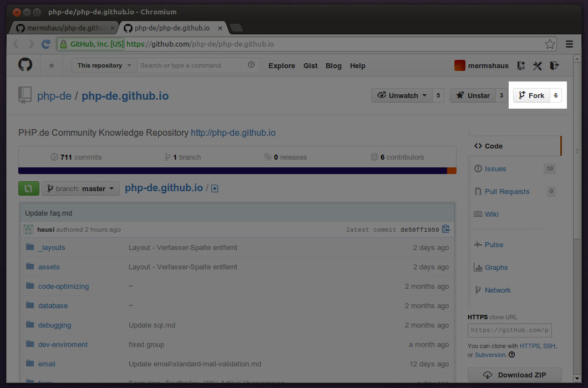
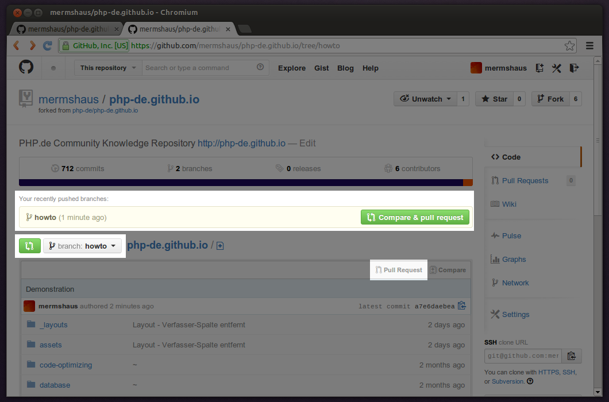
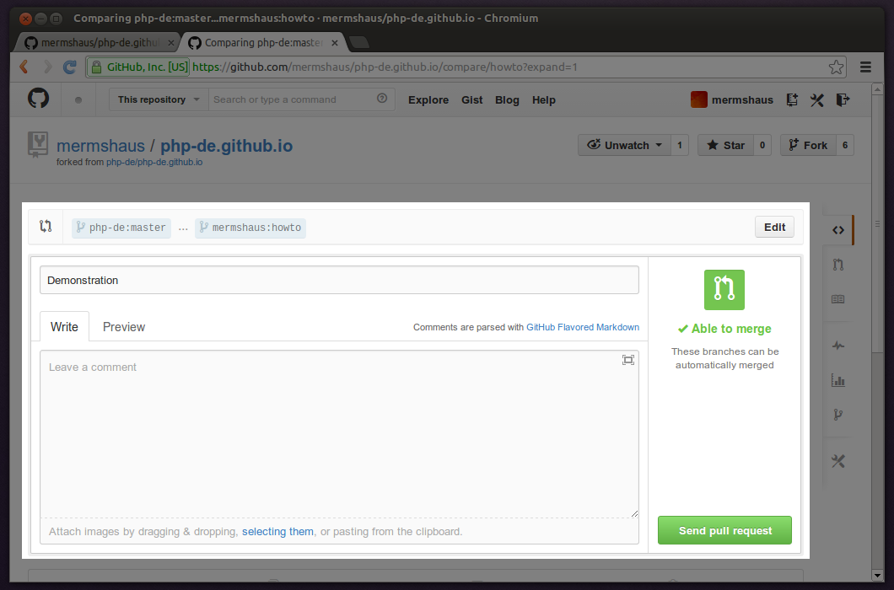

1. [Repository](https://github.com/php-de/php-de.github.io) forken.

   

2. Fork clonen.

   `mermshaus` nachfolgend bitte immer durch den eigenen Nutzernamen ersetzen.

   ~~~
   $ git clone git@github.com:mermshaus/php-de.github.io phpde-io
   $ cd phpde-io/
   ~~~

   Der Befehl erstellt eine Kopie des geforkten Repositories im
Unterverzeichnis `phpde-io` (wird neu angelegt). Die Angabe des Verzeichnisses
kann dabei entfallen. In dem Fall entspräche das angelegte Unterverzeichnis dem
Namen des Repositories (`php-de.github.io`).

3. Topic-Branch erstellen.

   ~~~
   $ git checkout -b how-to
   ~~~

   `how-to` ist der Name des Branches. Er ist frei wählbar.

4. Änderungen vornehmen und committen.

5. Branch in Fork auf GitHub pushen.

   ~~~
   $ git push -u origin how-to
   ~~~

6. Pull-Request im GitHub-Interface erstellen.

   Der Pull-Request an das Original-Repository kann nun im Web-Interface des
Forks ausgelöst werden. Dazu kann jedes der hervorgehobenen UI-Elemente genutzt
werden:

   

   Liegt der Push des Branches noch nicht lange zurück, antizipiert GitHub den
Wunsch, einen Pull-Request abzusenden, und bietet die Funktion automatisch gut
sichtbar an (oberes Feld). Ansonsten muss der korrekte Branch ausgewählt werden
(linkes Feld), um dann mit einem der anderen beiden Buttons (links und rechts)
den Pull-Request zu beginnen.

   In jedem Fall wird daraufhin diese Seite erreicht:

   

   Hier sollte in das obere Feld eine aussagekräftige Kurzbeschreibung der
durchgeführten Änderungen eingetragen werden. Diese kann bei Bedarf durch
weiteren Text ergänzt werden, der als Kommentar zum Pull-Request dargestellt
wird.

   Ein Klick auf den Bestätigungsbutton übermittelt den Pull-Request, der nun
als offene Issue im Web-Interface des Original-Repositories auftaucht und
diskutiert oder von einem Administrator des Projekts angenommen und gemerget
werden kann.

Ist nach dem Merge die Arbeit erledigt, für die der Topic-Branch vorgesehen
war, kann der Branch folgendermaßen gelöscht werden:

1. Topic-Branch im Fork löschen.

   ~~~
   $ git push --delete origin how-to
   ~~~

2. Lokalen Topic-Branch löschen.

   ~~~
   $ git checkout master
   $ git branch -D how-to
   ~~~

Die lokale Version und der eigene Fork des Repositories auf der GitHub-Seite
können so aktualisiert werden:

1. Lokale Version updaten.

   ~~~
   $ git remote add source git@github.com:php-de/php-de.github.io
   $ git pull source master
   ~~~

2. Fork updaten.

   ~~~
   $ git push origin master
   ~~~
